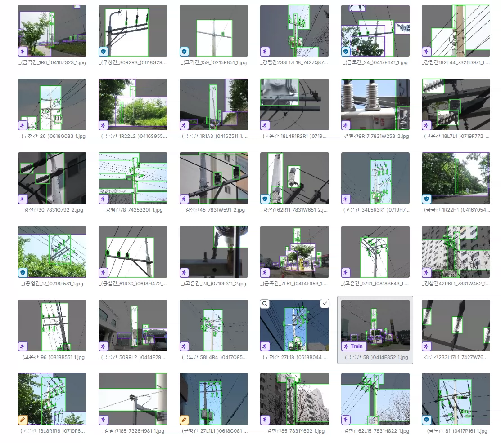
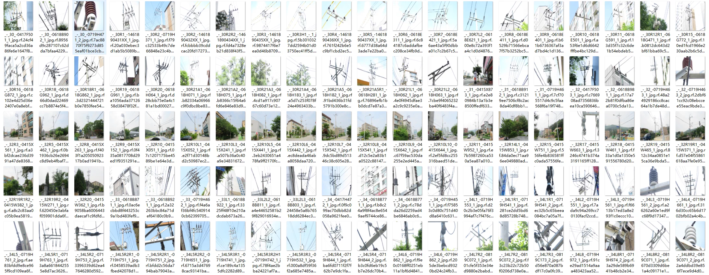
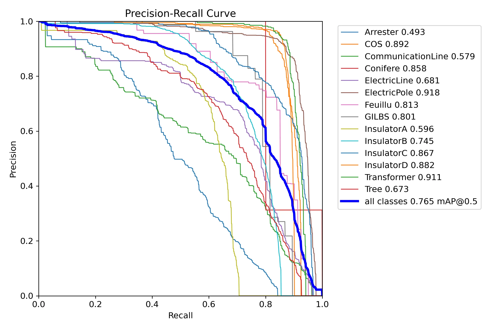
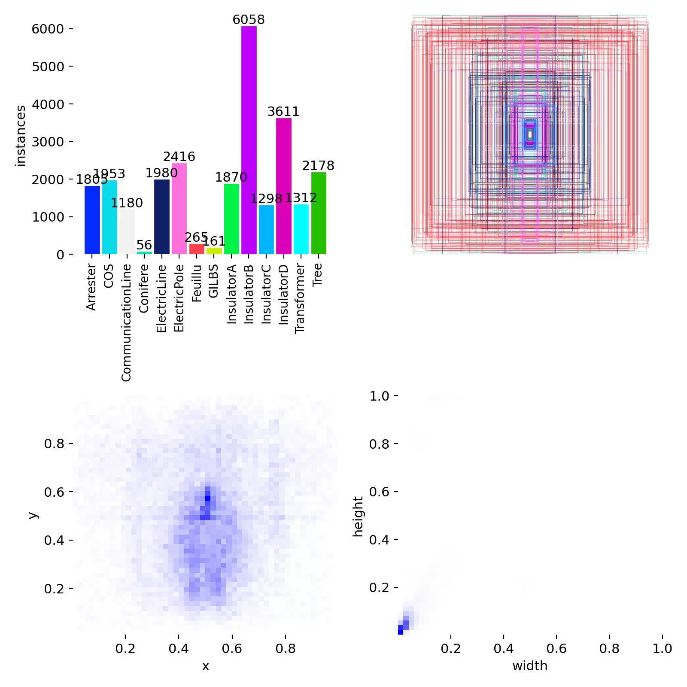
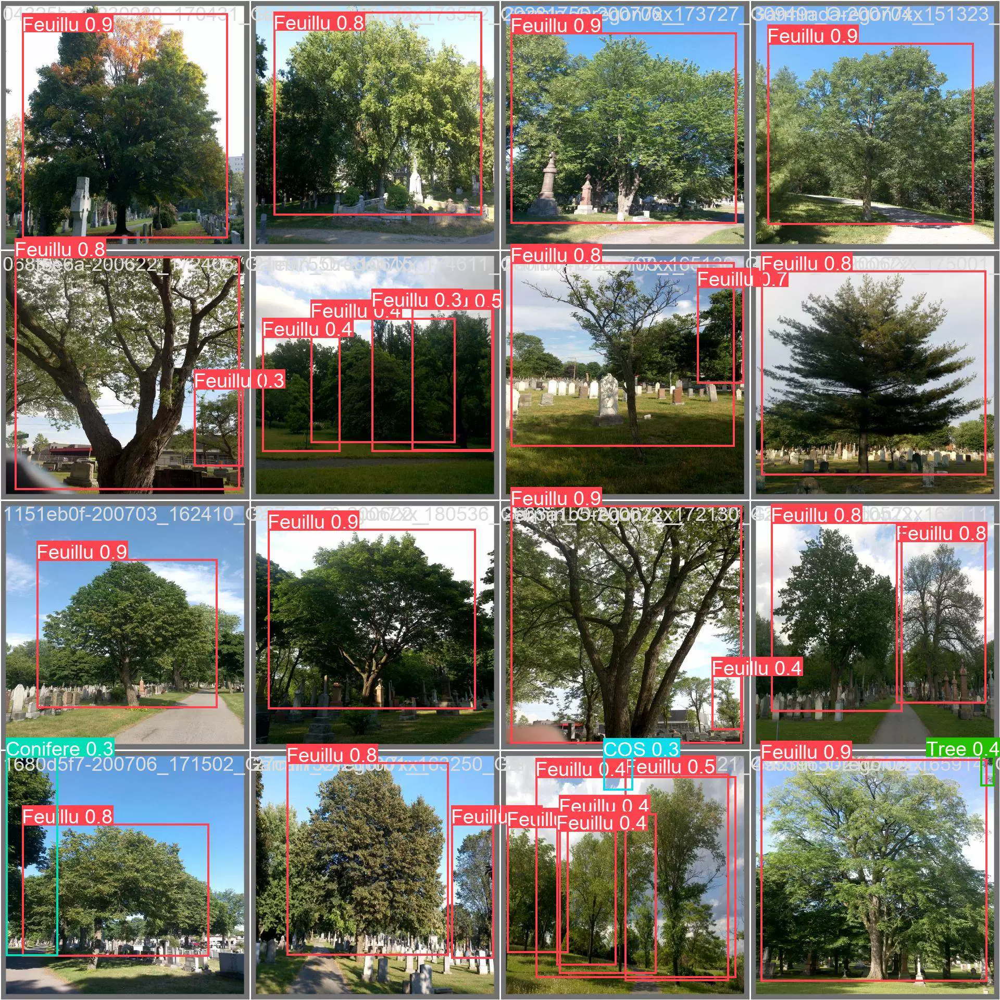
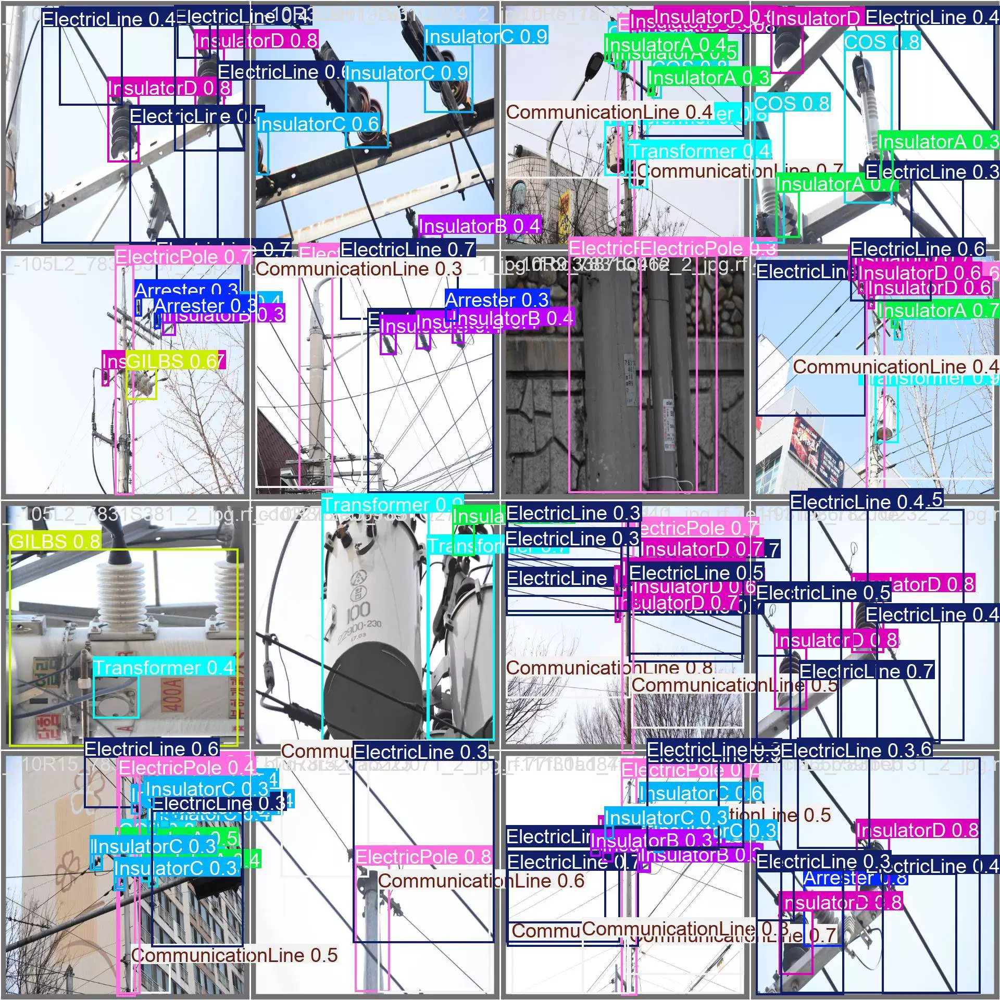
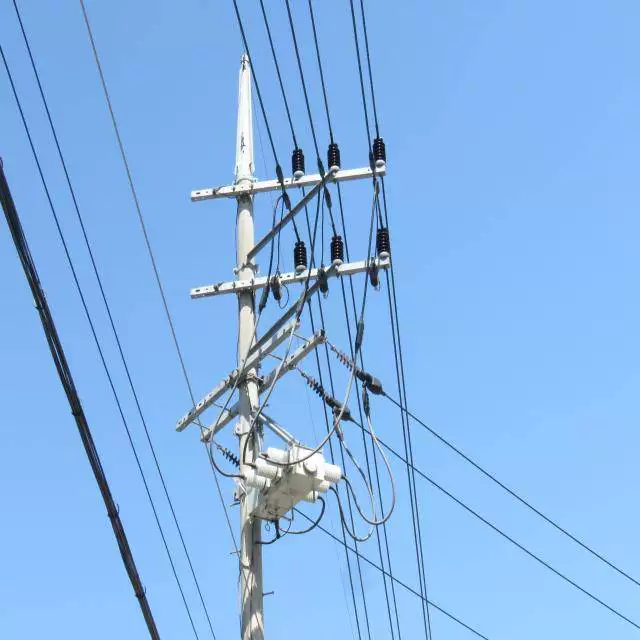
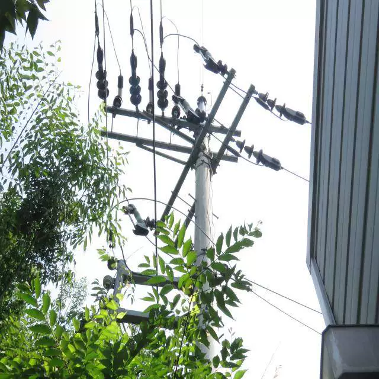
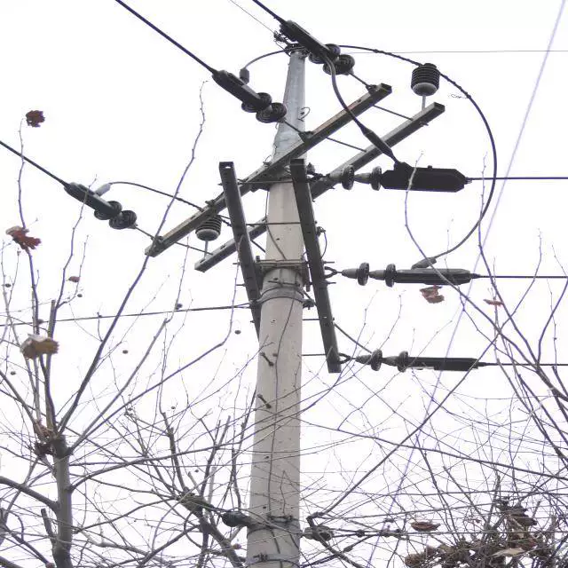

## Body

The dataset for target detection of electric poles and wires is in YOLO format.

There are a total of 3654 images, each labeled with tags, and the training, validation, and test sets have been clearly divided.

The dataset is divided into 14 categories, including: 'Arrester', 'COS', 'CommunicationLine', 'Conifere', 'ElectricLine', 'ElectricPole', 'Feuillu', 'GILBS', 'InsulatorA', 'InsulatorB', 'InsulatorC', 'InsulatorD', 'Transformer', 'Tree'. The Chinese translation is as follows: '避雷器', 'COS', '通信线路', '针叶树', '电力线路', '电杆', 'Feuillu', 'GILBS', '绝缘子A', '绝缘子B', '绝缘子C', '绝缘子D', '变压器', '树木'.

The dataset includes the YOLOv8s target detection weights file (training rounds 100, pre-trained model YOLOv8s.pt, mAP@0.5 0.765) along with the training results file.

## Images

item_1070648100377

Here is a pay link on Stripe ( https://buy.stripe.com/3cs8yP7sY87d0vu9AB ). Please contact me lonlonago@foxmail.com after funding $89, and I will send you a complete data files , thank you!

